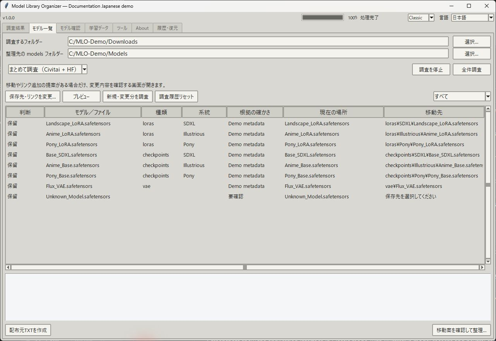
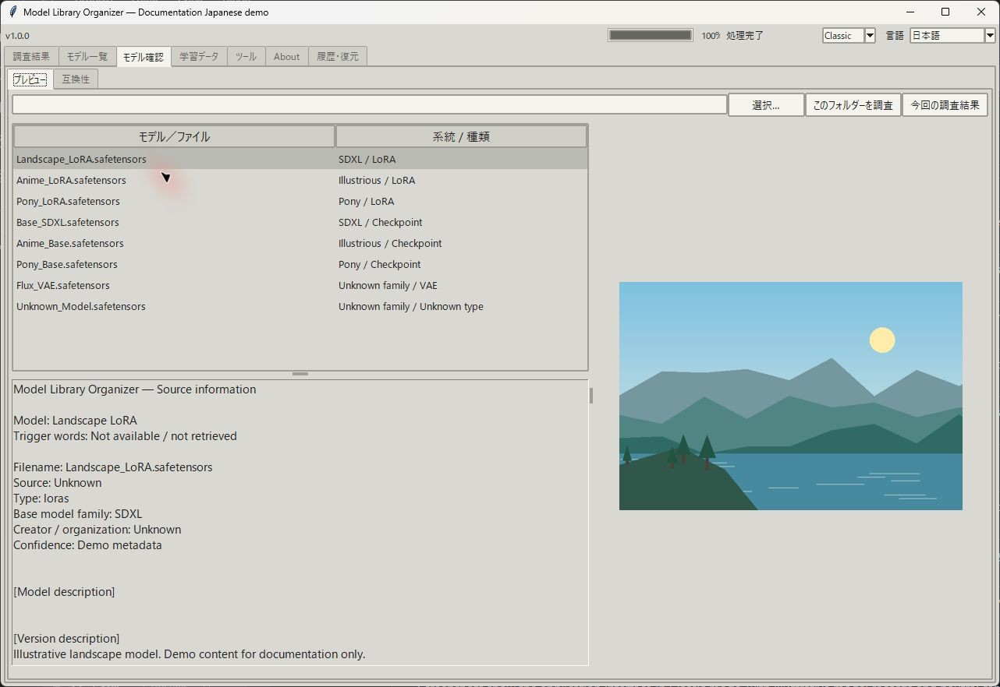
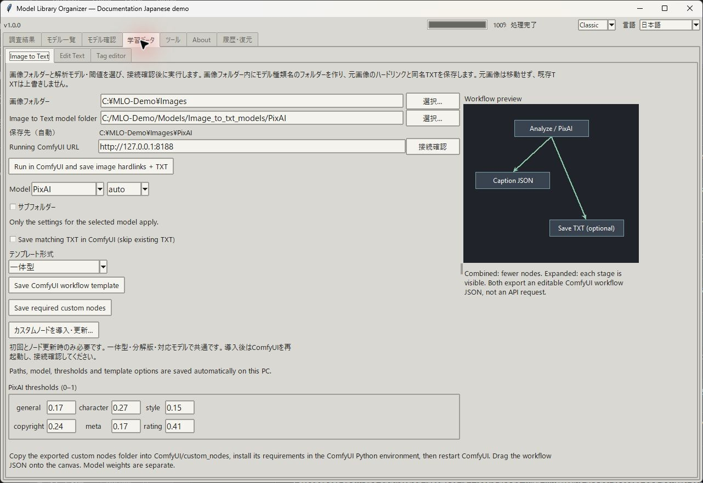
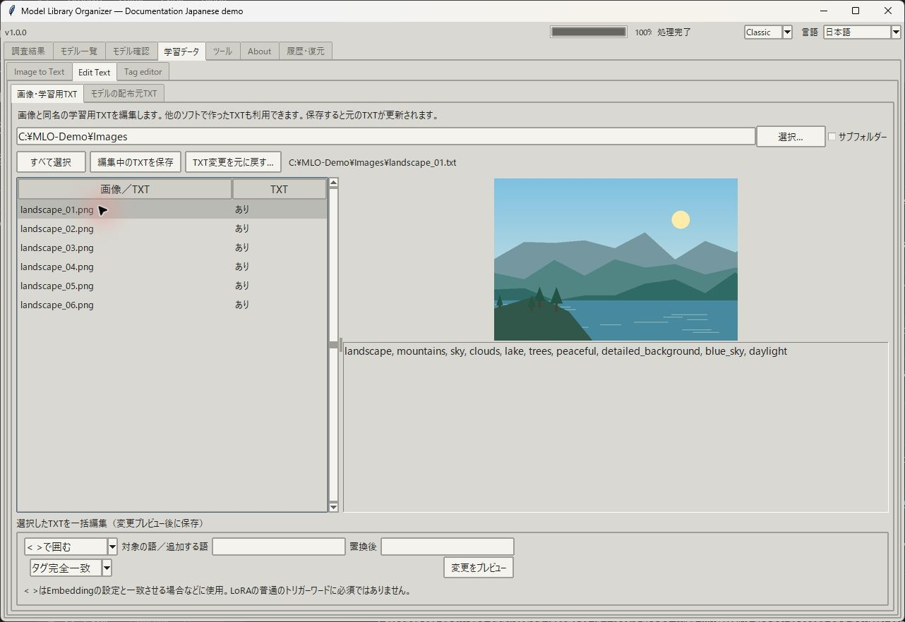
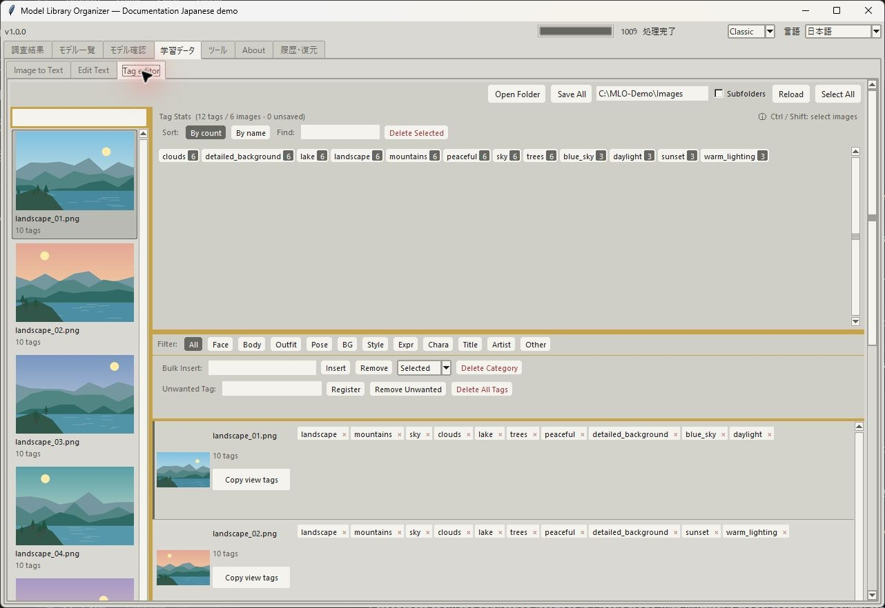

# Model Library Organizer

**Windows · v1.0.0 · MITライセンス**

[English](README.md) · **日本語** · [简体中文](README.ZH.md)

[Windows版をダウンロード](https://github.com/Take-No-Break/ModelLibraryOrganizer/releases/tag/v1.0.0) · [画面プレビュー](#モデルライブラリを整理する) · [問題を報告](https://github.com/Take-No-Break/ModelLibraryOrganizer/issues)

ダウンロードしたLoRAやチェックポイントを一覧で確認し、プレビュー画像、公開トリガーワード、説明文をアプリ内で閲覧できます。公開APIで情報を取得するため、配布サイトを一つずつ開く手間を減らせます。モデルの識別・フォルダ整理、配布元TXTの作成、Image to Textワークフローの準備、学習用キャプションやタグの編集にも対応しています。

## できること

| 項目 | 機能 |
| --- | --- |
| [モデル一覧](#モデルライブラリを整理する) | サブフォルダを含めて対応ファイルを調査。SHA-256で配布元を照合し、種類・系統・未識別ファイルを確認。 |
| [フォルダ整理](#モデルライブラリを整理する) | 種類・用途別、または配布元 → 作者 → 種類 → 系統で整理。移動やハードリンクを確認し、承認した変更の実行時に必要なフォルダを作成。 |
| [モデル確認](#モデルをプレビューする) | 説明、トリガーワード、配布元リンク、画像をアプリ内で表示。表示領域の大きさも調整可能。 |
| [互換性](#互換性) | LoRAを一つ選び、指定フォルダの識別済みチェックポイント・拡散モデルと系統を比較。組み合わせごとの実測結果を手動記録。 |
| [配布元TXT](#モデルの配布元txt) | トリガーワード、配布元、種類、系統、ハッシュを読みやすいTXTに保存。追加項目の選択や、バックアップ付きの更新に対応。 |
| [Image to Text](#image-to-text) | 一体型・分解型のComfyUIワークフローを出力。必要なカスタムノードの導入・更新、ローカルComfyUIでの実行にも対応。 |
| [Edit Text](#edit-text) | 画像とTXTの組、またはTXT単体を確認。個別編集、一括追加・削除・置換・括弧で囲む操作。 |
| [Tag editor](#tag-editor) | サムネイルとコンパクトなタグ表示。検索、フィルター、使用数の並べ替え、一括挿入・削除、変更確認後の保存。 |
| [調査結果と復元](#調査結果履歴と復元) | 操作結果、SHA-256による重複検出、移動履歴、復元可能な変更、対応ワークフローの参照修復を確認。 |

**LoRA / Checkpointの学習準備：** Image to Text、Edit Text、Tag editorでデータセットのテキストを作成・編集します。配布元TXTはダウンロードしたモデルの情報メモです。このアプリは学習データを準備します。LoRA・Embeddingの学習や画像生成そのものは行いません。

AIアシスタントにこのリポジトリやREADMEの使い方を案内してもらえます：[全操作ガイド（英語）](docs/CONTROLS.md)。

## Windowsへの導入

1. Releasesから **Windows-x64.zip** をダウンロードし、全体を展開します。
2. `Install.cmd`を実行するか、`ModelLibraryOrganizer.exe`を直接起動します。`_internal`はEXEと同じ場所に置いてください。
3. 自分のフォルダを選択します。モデル本体、個人パス、履歴、ComfyUIは同梱していません。

`Uninstall.cmd`も同梱しています。記録されたアプリファイルを削除し、モデルライブラリとユーザーデータを残す設計です。**アンインストーラーは実行・テストしていません。** ローカルテストと配布EXEの起動確認は実施していますが、別PC・仮想マシンでの検証は実施していません。

## モデルライブラリを整理する



1. ダウンロードしたモデルがある「調査するフォルダー」を選びます。サブフォルダも調査します。
2. 「整理先の models フォルダー」に`ComfyUI/models`や共有モデルフォルダを指定します。ComfyUIアプリのルートではなく、実際のmodelsフォルダを選んでください。
3. 「全件調査」を押し、整理方式を選んで提案を確認します。調査では元のパスの一覧を記録しますが、ファイルは移動しません。
4. 変更を承認・拒否・保留にしてから「移動案を確認して整理…」へ進みます。最終確認で変更内容を説明し、実行前に移動履歴を保存します。

整理先の例（情報が得られた場合は用途別フォルダも使用します）：

```text
models/loras/Character/Pony/example.safetensors
models/Civitai/ExampleCreator/loras/Pony/example.safetensors
```

系統フォルダは配布元の情報から作成する提案であり、固定のフォルダ一式を同梱する方式ではありません。新しい系統も提案でき、承認した変更の実行時に作成します。不明な系統は推測せず、種類別フォルダや`Unknown`への提案、または確認待ちにします。すでに適切な場所にあるファイルはその場所を維持できます。

整理のためにファイルを削除しません。条件を満たした空の移動元フォルダだけを削除します。移動先の競合は確認対象になります。

### 識別の仕組み

対応ファイルごとに完全なSHA-256を計算します。Civitaiでは公開ハッシュAPIで照合します。Hugging Faceではファイル名から候補を検索し、公開SHA-256で検証します。ファイル名だけの一致は検証済みの一致ではありません。キャッシュ、テンソル名・形状、埋め込みメタデータも種類の識別に使用します。

LoRA、チェックポイント、VAE、Embedding、対応するControlNet構造、スタイルアダプター、モデルパッチ、対応するキャプションモデル一式などを識別します。既存のComfyUI分類を維持できますが、フォルダ名に対応していることは、中の全モデルを識別できるという意味ではありません。信頼できるファイル単位のテンソル構造を、配布ページ全体の分類より優先します。未識別・矛盾のあるファイルは確認対象として残します。

SeaArtとTensor.Artは自動照合しません。検証済みの逆引きハッシュAPI連携がないためです。配布元URLがわかる場合は手動追加してください。配布元との一致は、実行時の互換性を保証しません。

### モデルをプレビューする



1. 調査後に「モデル確認 → プレビュー」を開きます。
2. 一覧からLoRA、チェックポイント、その他の識別済みモデルを選びます。
3. 一覧下のトリガーワード、種類、系統、配布元の説明を確認します。
4. 右側の画像を確認します。元のページが必要な場合だけ配布元リンクを開きます。

対応配布元で公開されている情報を使用します。取得できないトリガーワードや画像は作りません。

### 互換性

1. 「モデル確認 → 互換性」でチェックポイントとLoRAのフォルダを選びます。
2. 指定フォルダを調査し、LoRAを一つ選びます。
3. 識別済みチェックポイントと比較します。**緑**は同じ系統、**黄色**は関連するSDXL系統、**グレー**は異なる系統または不明です。
4. 行をクリックして、自分で行った読み込み・生成テストの結果を記録します。

色はメタデータからの推定です。生成テストや動作保証ではありません。各PCでフォルダの選択と調査が必要です。

### モデルの配布元TXT

1. 調査後に、情報を保存したいモデルを選びます。
2. 「Edit Text → モデルの配布元TXT」で追加項目を選びます。基本情報と取得できた公開トリガーワードは常に含みます。
3. 「配布元TXTを作成」で、モデルの隣に未作成の`model-name.safetensors.source.txt`を作ります。
4. 「テキストを読みやすく更新」は、アプリが作った既存TXTをバックアップ付きで再作成するときに使用します。

未選択の場合は一覧の対象モデルに作成します。既存TXTはスキップします。ラベルは英語、説明文は配布元の言語を維持します。これはモデルの情報メモであり、画像の学習用キャプションではありません。モデル本体は変更しません。

## Image to Text

対応アダプターは **PixAI、JoyCaption、CL Tagger、Taggerine** です。任意の`.safetensors`ではなく、必要なファイルが揃ったモデルフォルダを選びます。重みと依存ライブラリは別途導入してください。任意のImage to Textモデルすべてに自動対応するものではありません。



### カスタムノードの初回設定

1. 「カスタムノードを導入・更新…」を押します。
2. 「検出」、またはフォルダ選択で、実際に使用するComfyUIの`custom_nodes`を指定します。
3. 「導入・更新」を押し、必要な依存ライブラリをComfyUIのPythonに導入して、ComfyUIを再起動します。
4. 起動中のローカルComfyUIのURLを入力し、「接続確認」を押します。

同じノード一式を4種類の対応アダプターと両方の形式で使用します。パス・モデル・形式の変更だけでは再導入は不要です。ノードのコードが更新された場合に更新してください。アプリはComfyUIを起動・再起動しません。

ZIPで手動導入する場合は「Save required custom nodes」で保存し、`ComfyUI/custom_nodes/model_library_organizer_bridge/__init__.py`になるよう展開します。[詳しい導入手順（英語）](docs/CONTROLS.md#custom-node-setup)も参照できます。

### 実行または書き出し

1. 画像フォルダ、アダプター、必要なファイルが揃ったモデルフォルダを選びます。
2. 閾値やプロンプトを設定し、自動の保存先を確認します。
3. 直接実行する場合は「接続確認」後、「Run in ComfyUI and save image hardlinks + TXT」を押します。
4. 書き出す場合は「一体型」または「分解版」を選び、必要なら「Save matching TXT in ComfyUI」をオンにして「Save ComfyUI workflow template」を押します。JSONをComfyUIで開いて実行します。

**ワークフローテンプレート**は編集可能なノード図、**必要なカスタムノード**はそのノードを動かすコードです。保存するだけでは画像解析やTXT作成は行いません。

出力は選択した画像フォルダ内の、アダプター名のサブフォルダに保存します。

```text
Images/
├─ example.png              # 元画像
└─ PixAI/
   ├─ example.png           # 元画像へのハードリンク
   └─ example.txt           # 生成したキャプション
```

他のアダプターでは`JoyCaption`、`CL-Tagger`、`Taggerine`を使用します。元画像は移動しません。ハードリンクは同じファイルシステムのボリューム内で使用し、画像を編集すると同じ実体に反映されます。既存キャプションはスキップし、競合画像を保護します。再帰的な調査では生成済み出力フォルダを除外します。

古いワークフローで出力先が空の場合は、元画像の隣にTXTを作る場合があります。カスタムノードを更新してComfyUIを再起動し、新しいテンプレートを書き出してください。

## Edit Text



1. データセットのフォルダを選ぶと、画像・TXT一覧を自動で読み込みます。
2. 画像とTXTの組を選び、画像を確認しながら右側で編集します。
3. 一括編集では複数ファイルを選び、括弧で囲む・先頭追加・末尾追加・削除・置換を選び、「変更をプレビュー」を押します。
4. 編集中のTXTを保存するか、一括変更の確認を承認します。元TXTはバックアップし、外部で変更されたファイルとの競合は保存を止めます。

### Tag editor



1. 「Open Folder」でフォルダを開き、左のサムネイルを確認します。
2. タグ使用数の並べ替え、検索、タグ選択で画像を絞り込みます。
3. キャプションのタグをクリックして編集するか、**Selected / Filtered / All**の範囲で一括挿入・削除します。
4. 「Save All」を押し、変更を確認して保存します。

数値はタグを使用するキャプションファイル数で、AIの確信度ではありません。カテゴリーフィルターはローカルのキーワードルールを使用します。保存するまで変更は未保存です。`< >`で囲むだけではEmbeddingを学習できません。学習ツールのトークン設定に合わせてください。

## 調査結果・履歴と復元

1. 「調査結果」でレポートを選び、調査・書き出し・キャプション変更を再確認します。
2. 「履歴・復元」で記録したファイル移動を確認します。
3. 復元可能な履歴を選ぶかJSONを開き、「この配置を復元」を選びます。
4. 最新の操作から戻し、確認画面の内容を確認します。

**移動履歴と紐づいていない調査一覧JSONだけでは、ファイルの場所を復元できません。** ファイルの変更・削除やパス競合がある場合は復元できないことがあります。履歴はモデル本体のバックアップではなく、外部操作は取り消せません。[ツールと復元の詳細（英語）](docs/CONTROLS.md#tools)に重複検出やワークフロー参照修復の説明があります。

## オフラインとプライバシー

- **オンライン照合：** ハッシュとHF検索用のファイル名を送信します。モデル本体やデータセット画像は送信しません。
- **完全オフライン：** 外部の配布元・プレビュー・更新への通信を停止します。ローカル機能、キャッシュ、別途起動したローカルComfyUIは使用できます。
- **レポートと更新：** ログは自動送信しません。共有前に内容を確認してください。更新確認はリリースページを開くだけで、自動インストールしません。

[サポート操作の詳細（英語）](docs/CONTROLS.md#about-support-and-updates)も参照できます。

## 開発と貢献

```powershell
python -m pip install -r requirements.txt
python scripts/run_tests.py
python -m pip install pyinstaller==6.22.3
python -m PyInstaller --noconfirm ModelLibraryOrganizer.spec
```

Windows CIはPython 3.12、ローカル配布版のビルドはPython 3.14.5を使用しました。整理機能のテストには使い捨てのデータを使用してください。[貢献方法](CONTRIBUTING.md)、[セキュリティ](SECURITY.md)、[リリース準備](RELEASE_PREPARATION.md)も参照できます。

## ライセンスと謝辞

アプリのソースは[MITライセンス](LICENSE)で公開しています。改善や貢献を歓迎しますが、MITは変更の還元を義務付けません。モデルの重みと外部依存ライブラリには、それぞれのライセンスと注意事項が適用されます。

タグエディターのUIは[unaya-git/TagFilter](https://github.com/unaya-git/TagFilter)をデザインの参考にしています。この表記は提携や推薦を意味しません。
