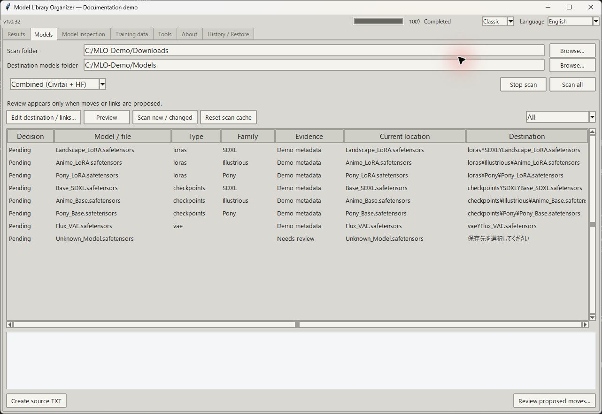
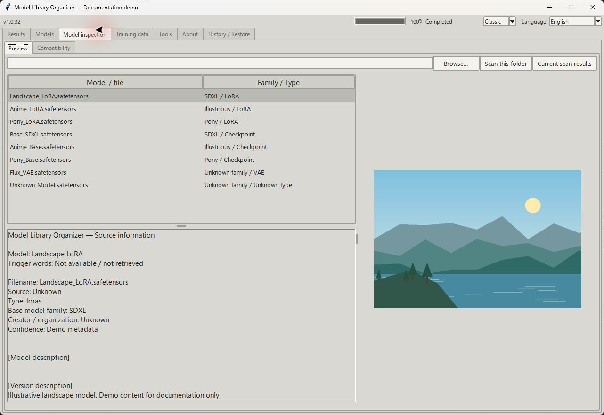
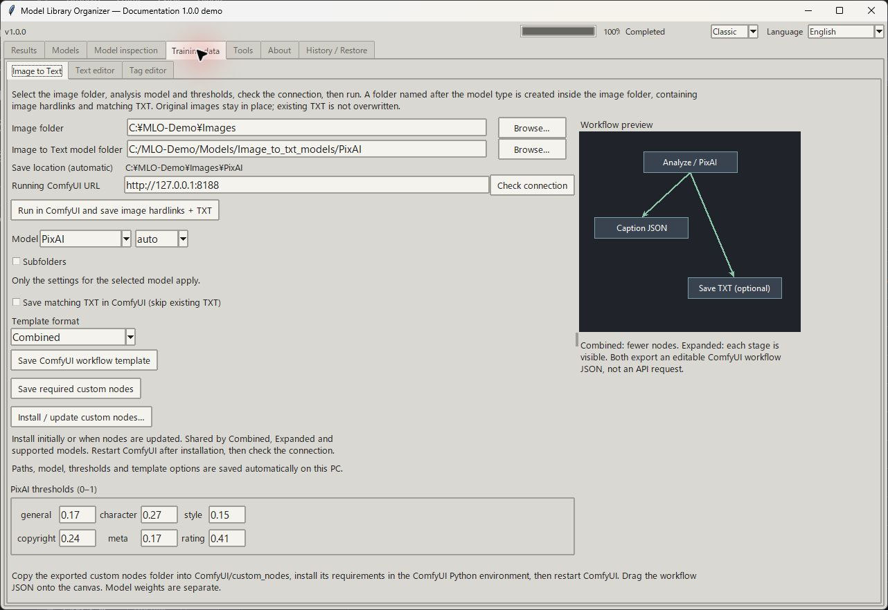
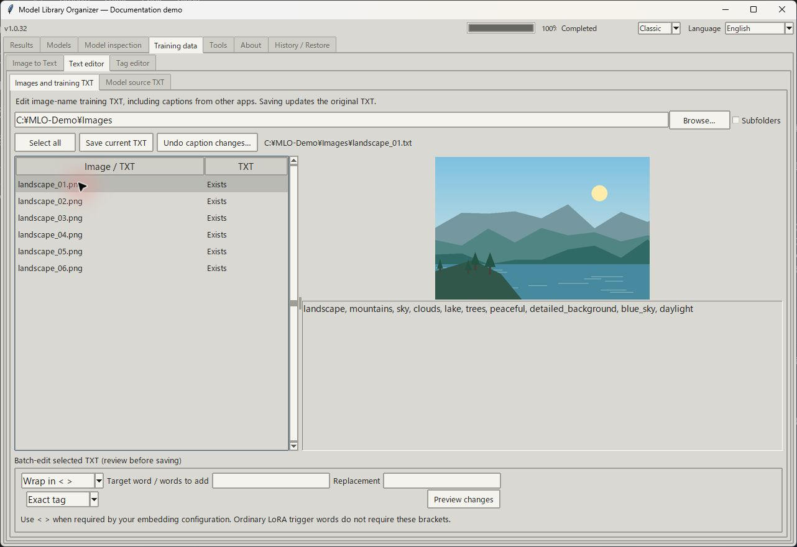
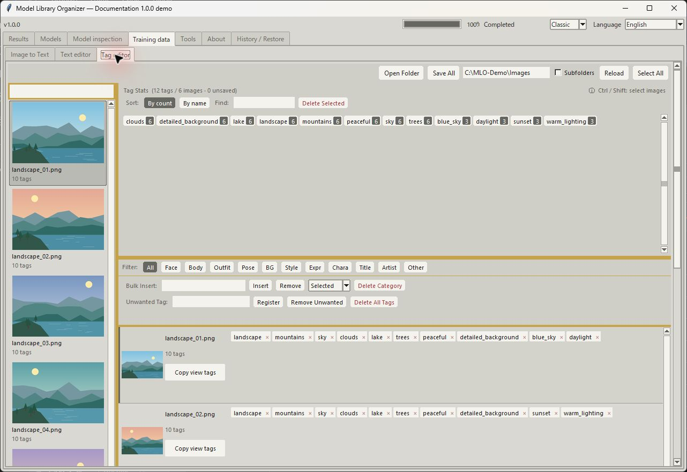

# Model Library Organizer

**Windows · v1.0.0 · MIT 许可证**

[English](README.md) · [日本語](README.JP.md) · **简体中文**

[下载 Windows 版](https://github.com/Take-No-Break/ModelLibraryOrganizer/releases/tag/v1.0.0) · [界面预览](#整理模型库) · [报告问题](https://github.com/Take-No-Break/ModelLibraryOrganizer/issues)

浏览已下载的 LoRA 和检查点模型，在应用内查看预览图片，以及通过公开 API 获取的触发词和描述，无需逐个打开来源网站。Model Library Organizer 还可以识别和整理文件、创建模型来源 TXT、准备 Image to Text 工作流，以及编辑训练用文本和标签。

## 可以做什么

| 功能 | 说明 |
| --- | --- |
| [模型列表](#整理模型库) | 递归扫描支持的文件，计算完整 SHA-256，匹配公开来源，识别类型和模型家族，检查未识别文件。 |
| [文件整理](#整理模型库) | 按类型和用途，或按平台 → 作者 → 类型 → 家族整理。审核移动和硬链接，执行获批变更时创建所需目录。 |
| [模型查看](#模型预览) | 在应用内查看可用的描述、触发词、来源链接和图片，调整预览区域大小。 |
| [兼容性](#兼容性) | 选择一个 LoRA，与指定目录中的全部已识别检查点或扩散模型比较家族，并手动记录各组合的测试结果。 |
| [来源 TXT](#模型来源-txt) | 保存可用触发词、来源、类型、家族和哈希；选择附加字段，或备份后更新已有说明文件。 |
| [Image to Text](#image-to-text) | 导出一体式或分解式 ComfyUI 工作流，安装或更新所需自定义节点，也可提交给本地 ComfyUI 执行。 |
| [Edit Text](#edit-text) | 查看图片与 TXT 配对或独立 TXT，单独编辑，批量前置、追加、删除、替换和包裹文本。 |
| [Tag editor](#tag-editor) | 浏览缩略图和紧凑标签，搜索、筛选、按出现次数排序，批量插入或删除标签，审核后保存。 |
| [结果与恢复](#结果历史与恢复) | 查看操作结果，按 SHA-256 检测重复文件，查看移动历史，恢复符合条件的操作，修复支持的工作流引用。 |

本应用用于准备训练数据，不直接训练 LoRA 或 Embedding，也不生成图片。

截图展示 Classic 主题的真实应用界面，模型记录和风景图片为演示样例。演示路径及模型信息不代表经过来源验证的下载模型。本页使用英文界面截图；日语版使用日语界面截图。

每个按钮、输入框和对话框的说明见[完整操作参考（英文）](docs/CONTROLS.md)。这份 Markdown 文档也可供 AI 助手读取。

## Windows 安装

1. 从 Releases 下载 **Windows-x64.zip**，并完整解压。
2. 运行 `Install.cmd`，或直接启动 `ModelLibraryOrganizer.exe`。请将 `_internal` 保留在 EXE 旁。
3. 选择自己的目录。安装包不包含模型权重、个人路径、历史记录或 ComfyUI。

附带 `Uninstall.cmd`，用于移除已记录的应用文件，保留模型库和用户数据。**卸载程序尚未运行或测试。** 已进行本地测试和打包程序启动验证，但没有宣称完成另一台电脑或虚拟机上的测试。

## 整理模型库



1. 选择包含下载模型的 **Scan folder**。扫描包括子目录。
2. 选择目标 **models folder**，例如 `ComfyUI/models` 或已配置的共享模型目录。请选择实际的 models 目录，而非 ComfyUI 程序根目录。
3. 点击 **Scan all**，选择整理方式并审核建议。扫描会记录原始路径清单，但不会移动文件。
4. 批准、拒绝或暂缓变更，然后使用 **Review and organize proposed moves**。最终确认会说明变更，并在执行前保存移动日志。

示例布局（获得相关元数据时，也可能包含用途目录）：

```text
models/loras/Character/Pony/example.safetensors
models/Civitai/ExampleCreator/loras/Pony/example.safetensors
```

家族目录来自来源返回的元数据，而不是预先打包的固定目录列表。新家族也可产生新目录建议，只有执行获批变更时才会创建。未知家族不会被猜测：可能建议类型目录、`Unknown`，或保留待审核。已正确放置的文件可以保持原位置。

不会为了整理布局而删除文件。只会移除符合条件的空源目录。目标位置冲突会标记为待审核。

### 如何识别模型

应用计算每个支持文件的完整 SHA-256。Civitai 使用公开哈希 API 查询；Hugging Face 按文件名搜索候选，并使用公开 SHA-256 验证。仅文件名相同并不代表已验证匹配。缓存、张量名称和形状、内嵌元数据也用于识别文件用途。

可识别 LoRA、检查点、VAE、Embedding、支持的 ControlNet 结构、风格适配器、模型补丁及支持的图像描述模型包。可以保留已有 ComfyUI 分类，但支持目录名称不等于能识别其中所有模型。可信的单文件张量结构优先于发布页面的整体分类。未识别或信息冲突的文件保留供审核。

SeaArt 和 Tensor.Art 不会被自动查询：本应用没有经过验证的反向哈希 API 集成。已知来源 URL 可手动添加。来源匹配不保证运行兼容性。

### 模型预览



1. 扫描后打开 **Model inspection → Preview**。
2. 从列表选择 LoRA、检查点或其他已识别模型。
3. 在列表下方查看可用触发词、类型、家族和来源描述。
4. 在右侧查看图片，仅在需要原始页面时打开来源链接。

信息必须由支持的来源公开提供；不会编造未取得的触发词或图片。

### 兼容性

1. 打开 **Model inspection → Compatibility**，选择检查点和 LoRA 目录。
2. 扫描这些目录，然后选择一个 LoRA。
3. 与所有已识别检查点比较：**绿色**为同一家族，**黄色**为相关 SDXL 家族，**灰色**为不同或未知家族。
4. 点击一行，记录自己进行的加载或生成测试结果。

颜色仅是基于元数据的估计，不是生成测试或保证。每台电脑都需要选择自己的目录并进行扫描。

### 模型来源 TXT

1. 扫描模型，然后选择要记录信息的模型。
2. 在 **Text editor → Model source TXT** 选择附加字段。基本身份信息和可用的公开触发词始终包含。
3. 点击 **Create source TXT**，在模型旁创建尚不存在的 `model-name.safetensors.source.txt`。
4. **Update readable TXT** 只用于备份后重新生成应用此前创建的说明文件。

未选择模型时，创建操作使用列表中符合条件的项目。已有说明会跳过。字段标签使用英文，描述保留来源语言。这些文件记录模型信息，不是图片训练文本。模型权重不会被修改。

## Image to Text

支持 **PixAI、JoyCaption、CL Tagger 和 Taggerine** 适配器。请选择所需文件齐全的模型目录，而非任意 `.safetensors`。权重和依赖项需另行安装；不会自动支持所有 Image to Text 模型。



### 首次设置自定义节点

1. 点击 **Install / update custom nodes**。
2. 使用 **Detect**，或浏览并选择实际使用的 ComfyUI 实例的 `custom_nodes` 目录。
3. 点击 **Install / update**，用 ComfyUI 的 Python 安装缺少的依赖，然后重启 ComfyUI。
4. 输入正在运行的本地 ComfyUI URL，点击 **Check connection**。

同一套节点支持四种适配器和两种模板格式。修改路径、模型或模板格式不需要重新安装。节点代码更新时再更新节点。应用不会启动或重启 ComfyUI。

手动 ZIP 安装：通过 **Save required custom nodes** 保存后解压，使入口文件位于 `ComfyUI/custom_nodes/model_library_organizer_bridge/__init__.py`。详细排查见[节点设置（英文）](docs/CONTROLS.md#custom-node-setup)。

### 运行或导出

1. 选择图片目录、模型适配器及完整模型目录。
2. 设置对应阈值或提示词，确认自动保存位置。
3. 直接执行时，点击 **Check connection**，然后点击 **Run in ComfyUI and save image hardlinks + TXT**。
4. 导出时选择 **Combined** 或 **Expanded**，按需启用 **Save matching TXT in ComfyUI**，点击 **Save ComfyUI workflow template**。在 ComfyUI 中打开 JSON 并运行。

**工作流模板**是可编辑的可视化节点图；**所需自定义节点**是让节点工作的代码。仅导出文件不会分析图片或保存文本。

输出保存在所选图片目录内，以适配器命名的子目录中：

```text
Images/
├─ example.png              # 原图
└─ PixAI/
   ├─ example.png           # 指向原图的硬链接
   └─ example.txt           # 生成的描述文本
```

其他适配器使用 `JoyCaption`、`CL-Tagger` 或 `Taggerine`。原图保留原位置。硬链接要求同一文件系统卷；编辑硬链接图片会影响同一底层文件。已有文本会跳过，冲突图片受到保护。递归扫描排除这些生成的输出目录。

旧工作流的输出设置为空时，可能把 TXT 写在原图旁。更新自定义节点、重启 ComfyUI，并导出新模板以使用子目录布局。

## Edit Text



1. 选择数据集目录，自动加载图片和 TXT 列表。
2. 选择图片与 TXT 配对，查看图片并在右侧编辑文本。
3. 批量编辑时选择多个文件，选择包裹、前置、追加、删除或替换，然后点击 **Preview changes**。
4. 保存当前 TXT，或批准批量审核。原文件会备份；外部编辑发生冲突时会阻止保存。

### Tag editor



1. 点击 **Open Folder**，浏览左侧缩略图。
2. 按标签出现次数排序、搜索，或选择标签筛选匹配图片。
3. 点击文本标签进行编辑，或按 **Selected / Filtered / All** 范围批量插入和删除。
4. 点击 **Save All**，审核变更后确认保存。

数值表示使用标签的文本文件数量，不是 AI 置信度。类别筛选使用本地关键词规则。编辑内容在保存前保持未保存状态。用 `< >` 包裹词语不会训练 Embedding；请与训练工具的 token 设置保持一致。

## 结果、历史与恢复

1. 打开 **Results**，选择报告，重新查看扫描、导出或文本变更。
2. 使用 **History / Restore** 查看已记录的文件移动。
3. 选择符合条件的历史记录，或打开其 JSON，然后选择 **Restore this layout**。
4. 优先恢复最新操作，并审核确认信息。

**没有关联移动日志的扫描清单无法恢复文件位置。** 文件被修改、删除或路径冲突可能阻止恢复。历史不是模型内容备份，也不能撤销外部操作。[工具及恢复详情（英文）](docs/CONTROLS.md#tools)说明了重复检测和工作流引用修复。

## 离线与隐私

- **在线查询：** 发送哈希和 HF 搜索文件名，不发送模型权重或数据集图片。
- **完全离线：** 阻止外部来源、预览及更新请求。本地工具、缓存及另行运行的本地 ComfyUI 仍可使用。
- **报告与更新：** 日志从不自动提交，分享前请检查。更新检查只打开发布页面，不自动安装更新。

详情见[支持相关操作（英文）](docs/CONTROLS.md#about-support-and-updates)。

## 开发与贡献

```powershell
python -m pip install -r requirements.txt
python run_tests.py
python -m pip install pyinstaller==6.22.3
python -m PyInstaller --noconfirm ModelLibraryOrganizer.spec
```

Windows CI 使用 Python 3.12，本地 Windows 发布包使用 Python 3.14.5 构建。请用可丢弃数据测试文件整理。参阅[贡献指南](CONTRIBUTING.md)、[安全说明](SECURITY.md)和[发布准备](RELEASE_PREPARATION.md)。

## 许可证与致谢

应用源码采用 [MIT 许可证](LICENSE)。欢迎贡献和改进，但 MIT 不要求将修改提交回原项目。模型权重及第三方依赖保留各自的许可证和声明。

标签编辑界面以 [unaya-git/TagFilter](https://github.com/unaya-git/TagFilter) 为设计参考。此致谢不代表背书或合作关系。
